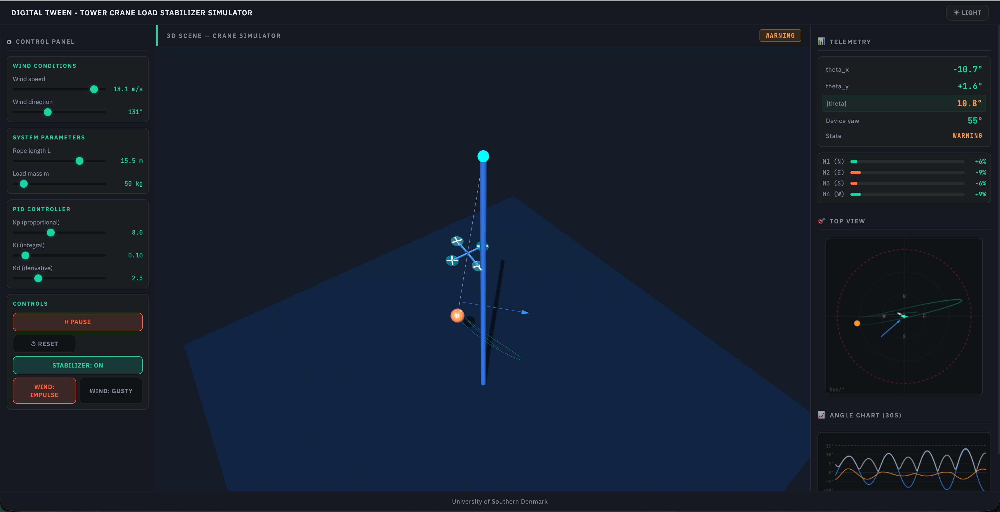

# 🏗️ Tower Crane Load Stabilization Simulator
### *DŹWIK — Digital Twin of an Active Load Stabilizer*

> An interactive physics-based web simulator of a tower crane with an active drone-propeller load stabilization system. Built as a digital twin prototype for educational and research purposes.

---

## 🎯 What it does

The simulator models a suspended load (cargo) on a crane rope as a **spherical pendulum**. Disturbances (wind gusts, impulses) cause the load to swing. A **cascade PID controller** drives four drone-style propellers mounted at the mid-cable point to counteract the swing in real time.

### ✨ Key features

| Feature | Description |
|---|---|
| ⚙️ **Physics engine** | Linearized spherical pendulum with RK4 numerical integration (dt = 16 ms) |
| 🎛️ **PID stabilizer** | Independent X/Y axis controllers with tunable Kp, Ki, Kd gains |
| 🚁 **Propeller mixer** | Maps 2D force output to N/E/S/W motor PWM signals with yaw correction |
| 🌐 **3D visualization** | Three.js scene with crane structure, spinning propellers, force vectors, wind arrow, and load trajectory trail |
| 🗺️ **2D top-down view** | Live load position, force vectors, and alarm circle |
| 📈 **Angle history chart** | Last 30 seconds of θx, θy, \|θ\| |
| 📡 **Live telemetry** | Angles, motor PWM bars, state badge (STABILIZING / WARNING / ALARM) |
| 🌗 **Dark / light theme** | Toggle between dark industrial and light UI |
| 💨 **Wind controls** | Speed/direction sliders, wind impulse button, gusty wind mode |

---

## 🖥️ Screenshot



---

## 📦 Requirements

- 🟢 **Node.js** ≥ 18
- 📦 **npm** ≥ 9
- 🌐 A modern browser with WebGL support (Chrome, Firefox, Edge, Safari)

> No build step, bundler, or transpiler required. The backend is a minimal Express server; all frontend code is plain ES6 modules loaded directly by the browser.

---

## 🚀 Running locally

```bash
# 1. Clone the repository
git clone https://github.com/mmartofel/crane_load_stabilization_simulator.git
cd crane-simulator

# 2. Install dependencies (Express only)
npm install

# 3. Start the server
npm start

# 4. Open in browser 🎉
http://localhost:3000
```

The server serves all static files from `public/` and listens on port 3000.

---

## 🗂️ Project structure

```
crane-simulator/
├── 🖥️  server.js          # Express static-file server
├── 📋  package.json
└── 📁  public/
    ├── 🏠  index.html     # App shell — 3-column layout (controls | 3D scene | telemetry)
    ├── 🎨  style.css      # CSS variables, dark/light themes, layout
    ├── ⚙️   sim.js         # Physics: Pendulum, PIDController, PropellerMixer classes
    ├── 🌐  renderer.js    # Three.js 3D scene (CraneRenderer class)
    └── 🎮  ui.js          # Animation loop, slider/button wiring, canvas charts
```

---

## 🎮 Controls

| Control | Description |
|---|---|
| 💨 Wind speed / direction | Set steady-state wind force |
| 🪢 Rope length | Pendulum length (affects oscillation frequency) |
| ⚖️ Load mass | Cargo weight |
| 🎛️ Kp / Ki / Kd | PID gains — tune stabilizer response |
| ▶️ Play / ⏸️ Pause | Start or freeze the simulation |
| 🔄 Reset | Return load to rest, clear graph and trail |
| 🚁 Stabilizer ON/OFF | Enable or disable propeller control |
| 💥 Wind impulse | Apply a 3× wind burst for 1 second |
| 🌪️ Gusty wind | Enable random wind magnitude variations |
| ☀️ LIGHT / 🌙 DARK | Toggle UI theme |

---

## 🧮 Physics model

Linearized spherical pendulum (small-angle approximation):

```
m·L·θx'' = F_wind_x − b·θx' − m·g·θx − F_prop_x
m·L·θy'' = F_wind_y − b·θy' − m·g·θy − F_prop_y
```

Integrated with **4th-order Runge-Kutta** at a fixed 16 ms timestep. Propeller forces are computed by the PID controller and mixed into four motor signals (North, East, South, West).

---

## 📚 External libraries (CDN, no install needed)

| Library | Version | Use |
|---|---|---|
| 🔺 Three.js | r128 | 3D rendering |
| 🎥 Three OrbitControls | r128 | Interactive camera |

---

🎓 *Developed as a prototype at the University of Southern Denmark.*
