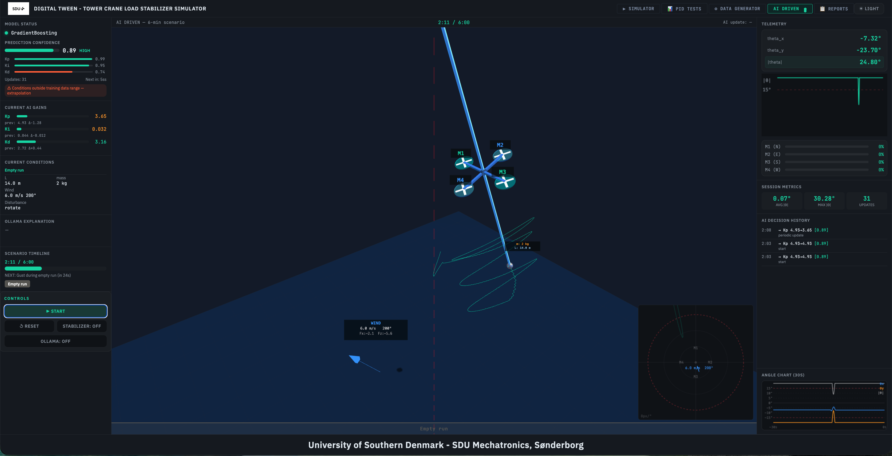
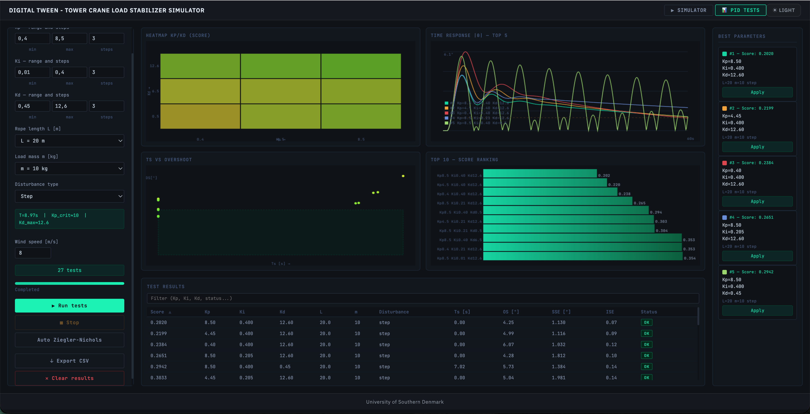
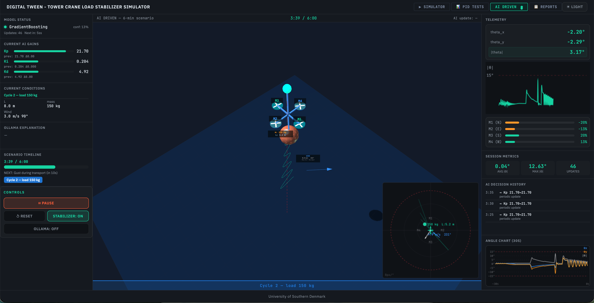
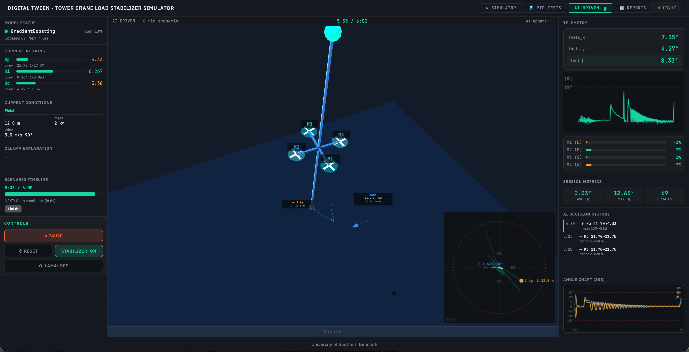
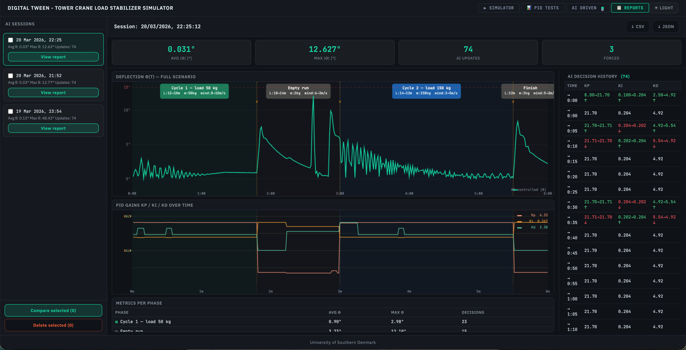
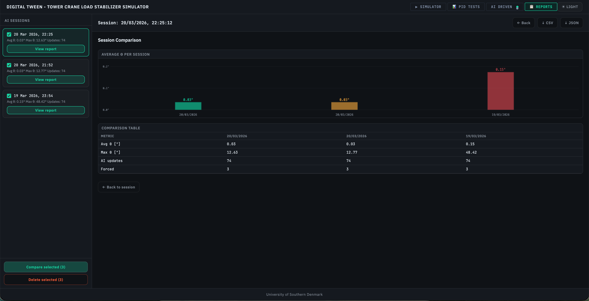

# 🏗️ Tower Crane Load Stabilization Simulator
### *DŹWIK — Digital Twin of an Active Load Stabilizer*

> An interactive physics-based web simulator of a tower crane with an active drone-propeller load stabilization system, plus an automated PID optimizer, an AI-driven 6-minute scenario, and a full reporting suite. Built as a digital twin prototype for educational and research purposes.

---

## 🎯 What it does

The simulator models a suspended load (cargo) on a crane rope as a **spherical pendulum**. Disturbances (wind gusts, impulses) cause the load to swing. A **cascade PID controller** drives four drone-style propellers (M1–M4) mounted at the mid-cable point to counteract the swing in real time.

A dedicated **PID Optimizer tab** allows automated grid-search and Ziegler-Nichols tuning across arbitrary parameter ranges and test scenarios, with four interactive charts for analysis and one-click gain application.

An **AI DRIVEN tab** runs a fully automated 6-minute scenario where a machine-learning model (GradientBoosting, trained on accumulated PID test results) selects optimal gains every 5 s, with an optional Ollama LLM providing natural-language explanations of each decision.

A **Reports tab** stores and compares AI-driven sessions, showing timeseries charts, phase breakdowns, decision histories, and multi-session bar-chart comparisons.

### ✨ Key features

| Feature | Description |
|---|---|
| ⚙️ **Physics engine** | Linearized spherical pendulum with RK4 numerical integration (dt = 16 ms) |
| 🎛️ **PID stabilizer** | Independent X/Y axis controllers with tunable Kp, Ki, Kd gains and integral windup protection |
| 🚁 **Propeller mixer** | Maps 2D PID force output to M1(N) / M2(E) / M3(S) / M4(W) motor PWM signals with yaw correction |
| 🌐 **3D visualization** | Three.js scene: crane structure, M1–M4 labelled spinning propellers, thrust arrows, wind arrow with speed/direction/force-component labels, load sphere with mass & L label, trajectory trail |
| 🗺️ **2D top-down view** | Live load position, M1–M4 force vectors with labels, wind parameters (speed, direction), load parameters (mass, L), trail, and alarm circles (5°/10°/15°) |
| 📈 **Angle history chart** | Last 30 s of θx, θy, \|θ\| with ±15° warning lines |
| 📡 **Live telemetry** | Angles, motor PWM bars M1–M4 (bidirectional teal/orange), state badge (READY / STABILIZING / WARNING / DRIFTING / ALARM) |
| 🌗 **Dark / light theme** | Toggle between dark industrial and light UI |
| 💨 **Wind controls** | Speed/direction sliders, step/impulse/ramp disturbance types, gusty wind mode |
| 🔬 **PID Optimizer** | Automated grid-search + Ziegler-Nichols tuning with physics-aware range suggestions |
| 📊 **Interactive charts** | Heatmap, time-response, scatter, bar — all with hover tooltips and click-to-apply |
| 💾 **Results persistence** | Save/load test results via server API; CSV export |
| 🤖 **AI DRIVEN tab** | 6-minute automated scenario; ML model predicts optimal PID gains every 5 s; optional Ollama LLM explanations |
| 📋 **Reports tab** | Session list, timeseries detail view, phase table, decision history, multi-session comparison bar chart, CSV/JSON export |

---

## 🖥️ Screenshot













---

## 📦 Requirements

- 🟢 **Node.js** ≥ 18
- 📦 **npm** ≥ 9
- 🐍 **Python** ≥ 3.9 *(optional — AI features only)*
- 🌐 A modern browser with WebGL support (Chrome, Firefox, Edge, Safari)

> No build step, bundler, or transpiler required. The backend is a minimal Express server; all frontend code is plain ES6 modules loaded directly by the browser.

---

## 🚀 Running locally

```bash
# 1. Clone the repository
git clone https://github.com/mmartofel/crane_load_stabilization_simulator.git
cd crane-simulator

# 2. Install dependencies (Express only)
npm install

# 3. Start the server
npm start

# 4. Open in browser 🎉
http://localhost:3000
```

The server serves all static files from `public/` and listens on port 3000.

### 🤖 AI features (optional)

The AI DRIVEN tab requires the Python/Flask ai-service running on port 5001:

```bash
cd ai-service
pip install flask scikit-learn numpy pandas requests
python app.py
```

The service exposes `/api/ai/predict`, `/api/ai/train`, `/api/ai/status`, and `/api/ai/ollama`. If the ai-service is not running, the AI DRIVEN tab falls back to analytical PID estimation automatically.

---

## 🗂️ Project structure

```
crane-simulator/
├── 🖥️  server.js                  # Express static-file server + REST API (results + sessions)
├── 📋  package.json
├── 📁  public/
│   ├── 🏠  index.html             # App shell — tabbed layout (SIMULATOR | PID TESTS | AI DRIVEN | REPORTS)
│   ├── 🎨  style.css              # CSS variables, dark/light themes, layout, shared button system
│   ├── 🎨  results.css            # PID optimizer tab styling
│   ├── 🎨  ai-ui.css              # AI DRIVEN tab styles
│   ├── 🎨  reports-ui.css         # Reports tab styles
│   ├── ⚙️   sim.js               # Physics: Pendulum, PIDController, PropellerMixer classes
│   ├── 🌐  renderer.js            # Three.js 3D scene: CraneRenderer + M1–M4/load/wind sprite labels
│   ├── 🎮  ui.js                  # Animation loop, slider/button wiring, top-view canvas, angle chart
│   ├── 🔬  optimizer.js           # BatchOptimizer, Ziegler-Nichols, composite scoring, physics ranges
│   ├── ⚡  optimizer-worker.js    # Web Worker for large batch grid-search (> 500 tests)
│   ├── 📊  results-ui.js          # PID tab UI: 4 interactive charts, table, modal, sidebar, API calls
│   ├── 🤖  ai-ui.js               # AI DRIVEN tab: AIController, animation loop, top-view canvas
│   ├── 🎬  ai-scenario.js         # 6-minute scenario definition (phases + wind/gust/ramp/rotate events)
│   └── 📋  reports-ui.js          # Reports tab: session list, detail view, comparison chart
├── 📁  server/
│   └── 🔌  results-api.js         # Results CRUD (file-backed)
├── 📁  ai-service/
│   ├── 🐍  app.py                 # Flask REST API: /api/ai/predict, /train, /status, /ollama
│   └── 🧠  model.py               # PIDPredictor: GradientBoosting + StandardScaler pipeline
└── 📁  data/
    ├── 📄  test_results.csv        # PID optimizer test results — see [data/README.md](data/README.md)
    ├── 📄  model_meta.json         # Model metadata (R², row count, training timestamp)
    └── 📁  ai_sessions/            # AI DRIVEN scenario session JSON files (used by Reports tab)
```

---

## 🎮 Controls — Simulator tab

| Control | Description |
|---|---|
| 💨 Wind speed / direction | Set steady-state wind force (0–20 m/s, 0–360°) |
| 🪢 Rope length (L) | Pendulum length 3–20 m (affects natural frequency) |
| ⚖️ Load mass (m) | Cargo weight 10–500 kg (scales PID range suggestions) |
| 🎛️ Kp / Ki / Kd | PID gains — tune stabilizer response; bounds are physics-aware |
| ▶️ Play / ⏸️ Pause | Start or freeze the simulation |
| 🔄 Reset | Return load to rest, clear graph and trail |
| 🚁 Stabilizer ON/OFF | Enable or disable propeller control |
| 💥 Wind impulse | Apply a 3× wind burst for 1 second |
| 🌪️ Gusty wind | Enable random wind magnitude variations |
| ☀️ LIGHT / 🌙 DARK | Toggle UI theme |

---

## 🔬 PID Optimizer tab

Switch to the **PID TESTS** tab to access automated tuning tools:

| Feature | Description |
|---|---|
| 📐 **Grid search** | Sweep Kp × Ki × Kd ranges with configurable step counts across multiple L/m/disturbance scenarios |
| ⚡ **Web Worker** | Batches > 500 tests run in a background worker to keep the UI responsive |
| 🎚️ **Ziegler-Nichols** | Binary-search for ultimate gain (Ku) and oscillation period (Tu); auto-computes Kp/Ki/Kd |
| 📏 **Physics ranges** | Suggested Kp/Ki/Kd bounds derived from rope length (`T = 2π√(L/g)`) and load mass |
| 📊 **Heatmap** | Kp × Kd score grid — hover for values, click to apply |
| 📈 **Time response** | Top-5 \|θ(t)\| curves — hover highlights curve, click to apply |
| 🎯 **Scatter plot** | Settling time vs. overshoot — "good zone" (Ts < 10 s, OS < 5°), hover/click |
| 📉 **Bar chart** | Top-10 composite scores — hover/click to apply |
| 🏆 **Best sidebar** | Top-5 ranked results always visible with one-click apply |
| 📋 **Results table** | 12-column sortable/filterable table; row click opens full detail modal |
| 💾 **Persistence** | Save to server, load saved results, export as CSV |

### Composite score metrics

Each test is evaluated on: **ISE**, **IAE**, **ITAE**, settling time (Ts), overshoot, and steady-state error — combined into a single weighted score (lower = better):

```
Score = 0.30·ISE_norm + 0.20·IAE_norm + 0.30·ITAE_norm + 0.15·Ts_norm + 0.05·OS_norm
```

---

## 🤖 AI DRIVEN tab

Switch to the **AI DRIVEN** tab for a fully automated 6-minute demonstration scenario:

| Feature | Description |
|---|---|
| 🎬 **Scenario phases** | Pre-defined wind/condition timeline (`ai-scenario.js`); initial wind 8 m/s with early gust for immediate visible deflection |
| 🧠 **ML gain prediction** | `AIController` requests PID gains from ai-service every 5 s using 7 physics features (L, m, wind speed/dir, ω₀, T) |
| 🔄 **Smooth transitions** | Predicted gains blend in over 2 s to avoid step changes in force output |
| ⚡ **Forced override** | Immediate re-prediction when load mass changes by > 5 kg |
| 💬 **LLM explanations** | Optional Ollama integration provides natural-language reasoning for each gain change (20 s proxy timeout); panel shows descriptive fallback when AI service or Ollama is unavailable |
| 📜 **Decision history** | 3 most-recent AI decisions (gain deltas, forced/fallback flags, reason text) |
| 🗺️ **Top-down canvas** | Full M1–M4 force vectors + gradient trail, wind parameters label, load parameters label |
| 📊 **Motor bars M1–M4** | Live bidirectional PWM display for all four propellers |
| 🚁 **Stabilizer ON/OFF** | Toggle propeller control mid-scenario; button in CONTROLS section |
| 💾 **Auto-save** | Session metrics and decision history auto-saved to REPORTS at end of scenario |

### Scenario phases (6 minutes)

| Phase | Time | Description |
|---|---|---|
| Cycle 1 — load 50 kg | 0–108 s | Attach cargo, gust, hoist (12 → 4 m), slew, wind increase, lower |
| Empty run | 108–180 s | Unhook, return, wind subsides |
| Cycle 2 — load 150 kg | 180–330 s | Heavy load, hoist, strong wind, slew, gust, lower |
| Finish | 330–360 s | Settle and end |

---

## 📋 Reports tab

Switch to the **REPORTS** tab to review and compare AI-driven sessions:

| Feature | Description |
|---|---|
| 📃 **Session list** | All saved sessions sorted by date; click to open detail view |
| 📈 **Deflection chart** | θ(t) 300px canvas, zero at 85% height; grid lines every 5°; phase color backgrounds + flag labels (name + L/m/wind params); forced-event markers |
| 📉 **PID gains chart** | Kp / Ki / Kd over time, 220px canvas; three independent Y-scales; same X-axis alignment as θ(t) chart; legend with current values |
| 🔗 **Hover correlation** | Mouse over any row in Decision History → yellow cursor line appears on both charts simultaneously with value circle(s) |
| 📋 **Phase table** | Per-phase avg/max θ and decision counts; all scenario phases always shown (with fallback computation if `session.phases` is empty) |
| 📜 **Decision history** | Full AI decision log in right column: time, gain deltas (prev→new ↑↓ with color), reason, forced/fallback flags |
| 📊 **Multi-session comparison** | Select 2–4 sessions; bar chart shows avg θ per session with auto-scaled Y-axis and degree labels |
| 🗑️ **Delete selected** | Checkbox-select one or more sessions and delete them; detail panel auto-advances to next available session |
| ↓ **Export** | Download decisions as CSV or full session as JSON |
| 📐 **Responsive layout** | Two-column viewport-fit layout; charts resize automatically via ResizeObserver |

---

## 🧮 Physics model

Linearized spherical pendulum (small-angle approximation):

```
m·L·θx'' = F_wind_x − b·θx' − m·g·θx − F_prop_x
m·L·θy'' = F_wind_y − b·θy' − m·g·θy − F_prop_y
```

Integrated with **4th-order Runge-Kutta** at a fixed 16 ms timestep. Propeller forces are computed by the PID controller and mixed into four motor signals:

| Motor | Position | Contributes to |
|---|---|---|
| M1 | North | +Y (θy) force |
| M2 | East | +X (θx) force |
| M3 | South | −Y (θy) force |
| M4 | West | −X (θx) force |

---

## 🌐 REST API

### Results (PID test persistence)

| Method | Endpoint | Description |
|---|---|---|
| `POST` | `/api/results` | Save batch of test results (JSON) |
| `GET` | `/api/results` | Load saved results (`?top=N&sort=score`) |
| `GET` | `/api/results/export` | Export as CSV |
| `DELETE` | `/api/results` | Clear all results |
| `GET` | `/api/csv-stats` | Row count in test_results.csv |

> See [data/README.md](data/README.md) for a full description of every CSV column, unit, and value range.

### Sessions (AI DRIVEN scenario persistence)

| Method | Endpoint | Description |
|---|---|---|
| `POST` | `/api/sessions` | Save completed AI session |
| `GET` | `/api/sessions` | List all sessions (newest first) |
| `GET` | `/api/sessions/:id` | Get one session by ID |
| `DELETE` | `/api/sessions/:id` | Delete a session |

### AI service proxy (→ port 5001)

| Method | Endpoint | Description |
|---|---|---|
| `POST` | `/api/ai/predict` | ML prediction: (Kp, Ki, Kd) from 7 physics features |
| `POST` | `/api/ai/train` | Retrain model on updated `pid_results.csv` |
| `GET` | `/api/ai/status` | Model readiness, R², row count, timestamp |
| `POST` | `/api/ai/ollama` | Proxy to local Ollama LLM for gain explanations |

---

## 📚 External libraries (CDN, no install needed)

| Library | Version | Use |
|---|---|---|
| 🔺 Three.js | r128 | 3D rendering + sprite label system |
| 🎥 Three OrbitControls | r128 | Interactive camera |
| 🔤 IBM Plex Sans | Google Fonts | UI typeface |
| 🔤 JetBrains Mono | Google Fonts | Monospace data/code display |

---

## 🤝 How to Contribute

Contributions are welcome! Please follow the standard GitHub fork-and-pull-request workflow:

### 1. Fork the repository

Click **Fork** on the GitHub page, then clone your fork locally:

```bash
git clone https://github.com/<your-username>/crane_load_stabilization_simulator.git
cd crane-simulator
```

### 2. Create a feature branch

```bash
git checkout -b feature/my-improvement
```

Use a descriptive name: `feature/…`, `fix/…`, or `docs/…`.

### 3. Make your changes

Follow the conventions in `CLAUDE.md`:
- All visible labels and UI text in **English**.
- All code comments in **English**.
- No build step required — test by running `npm start` and opening `http://localhost:3000`.

### 4. Commit with a clear message

```bash
git add <changed-files>
git commit -m "fix: correct PID integral windup threshold"
```

Use the [Conventional Commits](https://www.conventionalcommits.org/) style: `feat:`, `fix:`, `docs:`, `refactor:`, `test:`.

### 5. Push and open a Pull Request

```bash
git push origin feature/my-improvement
```

Then open a Pull Request against the `main` branch on GitHub. Describe **what** you changed and **why**.

### 6. Code-review and merge

A maintainer will review your PR. Address any feedback, then it will be merged.

---

### Reporting bugs or requesting features

Open a [GitHub Issue](https://github.com/mmartofel/crane_load_stabilization_simulator/issues) with a clear title and description. For bugs, include reproduction steps and browser/Node.js version.

---

🎓 *Developed as a prototype at the University of Southern Denmark.*
